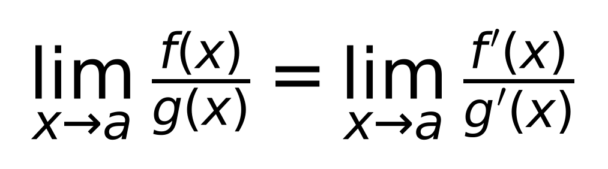

# 📅 每日学习 · 2026-08-24(周一)

> **考研倒计时: 125 天 · 强化阶段** ｜ 今日模式:**标准** ｜ 连续答对 0 次

📌 每天 30 分钟:知识点 → 小测 → 复习错题。本页每日自动更新。

## ✅ 今日任务

<DailyTasksComponent />

## 📖 今日科目

> 今日轮换:**📘 高等数学** + **🏭 炼油化工设备**(各 15 分钟)

- 📘 **高等数学**:知识库 14 条 · [查看笔记](/subjects/高等数学)
- 🏭 **炼油化工设备**:知识库 6 条 · [查看笔记](/subjects/炼油化工设备)

## ⏰ 到期复习

**37 条知识到期**,按间隔复习(SM-2),优先复习再学新的:

- ⚙️ **机械原理** · 运动副与机构运动简图(掌握 60%)
- 🇬🇧 **英语** · 词汇日-2026-08-07(掌握 50%)
- 🇬🇧 **英语** · 词汇日-2026-08-08(掌握 50%)
- 📘 **高等数学** · 无穷小的比较与等价无穷小替换(掌握 70%)
- 📘 **高等数学** · 函数的连续性与间断点(掌握 70%)
- 📘 **高等数学** · 极限的计算(掌握 60%)
- ⚙️ **机械原理** · 高副低代(掌握 60%)
- 🇬🇧 **英语** · lose 失去(词汇辨析)(掌握 60%)
- 🇬🇧 **英语** · 长难句翻译:by which 定语从句(掌握 30%)
- 📘 **高等数学** · 导数的定义与几何意义(掌握 60%)
- 📘 **高等数学** · 基本求导公式与四则运算法则(掌握 60%)
- 🇬🇧 **英语** · 高频词汇:maintenance 维护/eliminate 消除(掌握 60%)
- ...共 37 条

## 📚 今日知识点

**今日科目 📘 高等数学** 最新知识点:

### 定积分的换元积分法

> **掌握度:** 50% | **创建:** 2026-08-24

> 掌握度进度: █████░░░░░

**核心内容:**

与凑微分同理,但换元必须换限:令 u=g(x),则 x=a→u=g(a),x=b→u=g(b),求出原函数后直接代新上下限,不用换回 x

**图示:**

💡 点击展示例题答案

∫[0,1] x/(1+x²)dx:令 u=1+x²,du=2xdx→xdx=du/2;换限 x=0→u=1,x=1→u=2;原式=½∫[1,2]du/u=½ln2

---

### 定积分的概念与几何意义

> **掌握度:** 50% | **创建:** 2026-08-21

> 掌握度进度: █████░░░░░

**核心内容:**

定积分 ∫_a^b f(x)dx 表示曲边梯形(曲线y=f(x)、x轴、直线x=a与x=b所围区域)的带符号面积。定义:将[a,b]分n等份,取点ξi,作和式Σ f(ξi)Δxi,Δxi→0时极限存在且与分法、取法无关,则称f在[a,b]上可积,记该极限为定积分。必要条件:f在[a,b]上有界;充分条件:连续或只有有限个第一类间断点时可积。几何意义:轴上为正面积,轴下为负面积。

**图示:**

💡 点击展示例题答案

例:求 ∫_0^1 x dx。(解:被积函数y=x在[0,1]上与x轴围成直角三角形,底1高1,面积=1/2,故定积分=1/2。)

---

### 牛顿-莱布尼茨公式(微积分基本定理)

> **掌握度:** 50% | **创建:** 2026-08-21

> 掌握度进度: █████░░░░░

**核心内容:**

若F(x)是连续函数f(x)在[a,b]上的一个原函数(即F'(x)=f(x)),则 ∫_a^b f(x)dx = F(b)-F(a)。它把定积分的计算转化为求原函数再代上下限之差,是微分与积分联系的桥梁,也是定积分计算最核心的工具。求原函数(不定积分)的方法:基本公式、凑微分、分部积分、换元。

**图示:**

💡 点击展示例题答案

例:求 ∫_0^1 x² dx。解:F(x)=x³/3是x²的原函数,故∫_0^1 x² dx = (1³/3)-(0³/3)=1/3。

---

## 📊 掌握度速览

📘 高等数学

40%

⚙️ 机械原理

40%

🇬🇧 英语

100%

🏭 炼油化工设备

80%

## 📅 打卡日历(近 90 天)

> 🔥 **连续学习 1 天** · 近 90 天打卡 7 天 · 绿=已打卡 橙框=今天

## 🏅 里程碑

🔥

连续 7 天

还差 6 天

⚡

连续 14 天

还差 13 天

🏆

连续 30 天

还差 29 天

📘

高数 ≥50%

当前 40%

⚙️

机械 ≥70%

当前 40%

📝

累计 30 天

当前 7 天

## 📝 在线小测

今日题目已生成,去 [在线小测](/quiz) 答题(提交后 AI 自动批改 + 解题步骤,成绩写回学习进度)。
