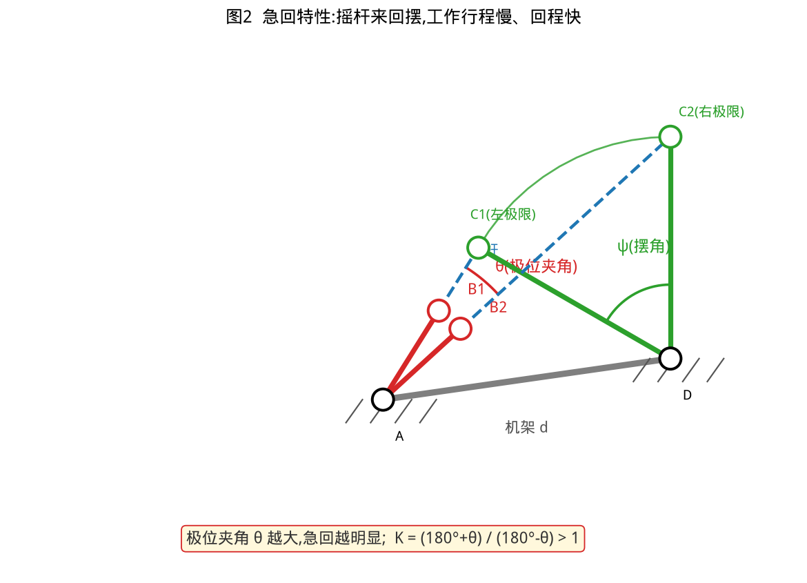
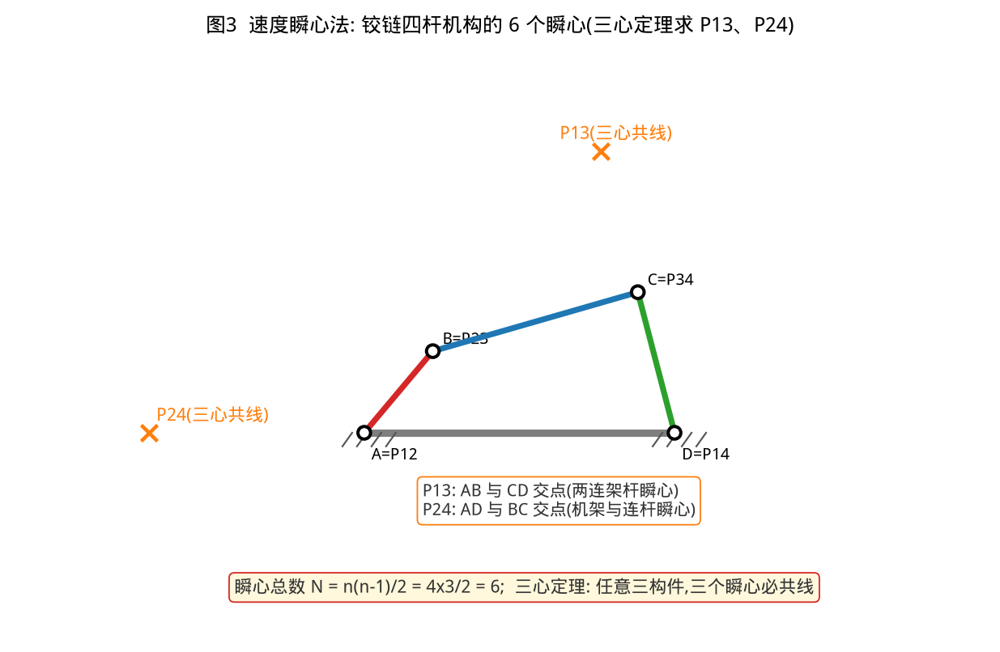
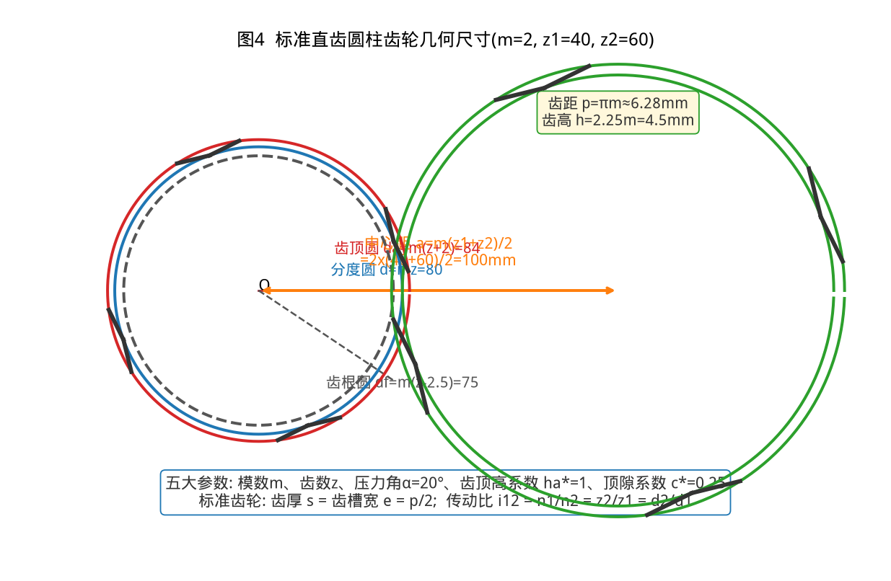

# ⚙️ 机械原理 知识点笔记

> 共 **12** 个知识点 · 隔天自动更新

## 平面机构自由度计算

>**掌握度:** 40% | **创建:** 2026-08-08 | **最近复习:** 2026-08-15

> 掌握度进度: ████░░░░░░

**核心内容:**

F=3n-2PL-PH(n=活动构件数,PL=低副数,PH=高副数)。三大陷阱:复合铰链(按构件数-1计低副)、局部自由度(滚子等去掉)、虚约束(重复约束去掉)。运动确定条件:F>0 且 F=原动件数。例题:铰链四杆机构 n=3,PL=4,PH=0 → F=1

**图示:**

💡 点击展示例题答案

铰链四杆机构 n=3,PL=4,PH=0 → F=3×3-2×4=1;原动件1个→运动确定,2个→卡死或不确定

---

## 运动副与机构运动简图

>**掌握度:** 60% | **创建:** 2026-08-08 | **最近复习:** 2026-08-08

> 掌握度进度: ██████░░░░

**核心内容:**

构件直接接触并能相对运动的连接叫运动副。低副=面接触(转动副、移动副),承载大耐磨;高副=点/线接触(齿轮副、凸轮副),易磨损但可实现复杂运动规律。运动简图用规定符号表示构件和运动副,忽略形状只反映运动传递关系

**图示:**

💡 点击展示例题答案

曲柄滑块机构(内燃机):曲柄-机架转动副,曲柄-连杆转动副,连杆-滑块转动副,滑块-机架移动副。n=3,PL=4,PH=0 → F=1

---

## 高副低代

>**掌握度:** 60% | **创建:** 2026-08-11 | **最近复习:** 2026-08-11

> 掌握度进度: ██████░░░░

**核心内容:**

高副(点/线接触)用虚拟构件+两个转动副替代,运动不变。转动副中心放在两轮廓曲率中心;接触元素为直线→曲率中心无穷远→转动副变移动副。替代前后F不变(ΔF=3-4+1=0)

💡 点击展示例题答案

凸轮-滚子:虚拟杆从凸轮圆心连到滚子中心,两端转动副;平底从动件→移动副

---

## 速度瞬心法

>**掌握度:** 60% | **创建:** 2026-08-11 | **最近复习:** 2026-08-12

> 掌握度进度: ██████░░░░

**核心内容:**

瞬心=两构件速度相同的点。转动副中心=瞬心;移动副瞬心在垂直于导路的无穷远;纯滚动高副瞬心在接触点。三心定理:3构件3瞬心共线。同一瞬心:v=ω1·r1=ω2·r2

**图示:**

💡 点击展示例题答案

四杆机构:ω3=ω1·P13A/P13D;P13=BC线与AD线交点

---

## 急回特性与行程速比系数K

>**掌握度:** 70% | **创建:** 2026-08-15 | **最近复习:** 2026-08-15

> 掌握度进度: ███████░░░

**核心内容:**

曲柄匀速转,摇杆往返时间不同:工作行程对应180°+θ,回程180°-θ。θ=极位夹角(曲柄与连杆两次共线时曲柄两位置夹角)。K=(180°+θ)/(180°-θ);K>1有急回,θ=0时K=1无急回

💡 点击展示例题答案

θ=30°→K=210/150=1.4(回程快40%);θ=36°→K=1.5

---

## 铰链四杆机构的基本型式与曲柄存在条件

>**掌握度:** 70% | **创建:** 2026-08-15 | **最近复习:** 2026-08-15

> 掌握度进度: ███████░░░

**核心内容:**

曲柄=能转整圈,摇杆=只能摆动。杆长条件:最短+最长≤其余两杆之和。满足时:最短杆=连架杆→曲柄摇杆;最短杆=机架→双曲柄;最短杆=连杆→双摇杆。不满足→必为双摇杆。连架杆=与机架共用铰链的杆(机架两端)

**图示:**

💡 点击展示例题答案

杆长2.5/3.5/4.5/5.5(机架):8≤8满足,最短2.5是连架杆→曲柄摇杆

---

## 渐开线齿廓与渐开线的性质

>**掌握度:** 60% | **创建:** 2026-08-18 | **最近复习:** 2026-08-18

> 掌握度进度: ██████░░░░

**核心内容:**

渐开线:直线沿基圆作纯滚动时,直线上任一点K的轨迹。性质:①K点的法线必与基圆相切(切点为渐开线在K点的曲率中心);②基圆内无渐开线;③渐开线形状取决于基圆半径,基圆越大渐开线越平直,基圆无穷大时成直线(即齿条齿廓);④同一基圆上任意两条渐开线沿公法线方向的距离相等(法向齿距=基圆齿距)。渐开线齿轮齿廓满足齿廓啮合基本定律→传动比恒定。

💡 点击展示例题答案

已知渐开线齿廓上某点K,该点法线与基圆相切于N点,基圆半径rb=50mm,K点距圆心rk=70mm,求压力角αK(提示cosαK=rb/rk)。解:cosαK=50/70=0.7143→αK≈44.4°

---

## 渐开线直齿圆柱齿轮的正确啮合条件与重合度

>**掌握度:** 60% | **创建:** 2026-08-18 | **最近复习:** 2026-08-18

> 掌握度进度: ██████░░░░

**核心内容:**

正确啮合条件:两齿轮法向齿距(基圆齿距)必须相等→m1=m2(模数相等)且α1=α2(压力角相等),即标准齿轮模数和压力角相同即可正确啮合。连续传动条件:实际啮合线段长度≥法向齿距,即重合度ε=实际啮合线长度/法向齿距≥1(通常取ε≥1.1~1.3)。重合度越大,传动越平稳,同时啮合的齿对数越多。标准直齿轮ε一般在1.1~1.9之间。

**图示:**

💡 点击展示例题答案

一对标准直齿圆柱齿轮,模数m=3,齿数z1=20,z2=50,压力角α=20°。判断能否正确啮合并估算传动比。解:m1=m2=3、α均20°→满足正确啮合。传动比i12=z2/z1=50/20=2.5(输出轴转速为输入1/2.5)。

---

## 渐开线直齿圆柱齿轮的五大基本参数

>**掌握度:** 60% | **创建:** 2026-08-18 | **最近复习:** 2026-08-18

> 掌握度进度: ██████░░░░

**核心内容:**

标准直齿圆柱齿轮的五个基本参数:①齿数z;②模数m=分度圆直径d/齿数z,d=mz,模数已标准化(优先系列1/1.25/1.5/2/2.5/3/4/5/6/8/10);③压力角α=20°(分度圆上标准);④齿顶高系数ha*=1;⑤顶隙系数c*=0.25。分度圆是计算基准圆,其上齿厚=齿槽宽。标准齿轮:分度圆上齿厚s=齿槽宽e=πm/2。齿顶高ha=ha*·m,齿根高hf=(ha*+c*)·m=1.25m,全齿高h=ha+hf=2.25m。

**图示:**

💡 点击展示例题答案

模数m=2,齿数z=30的标准直齿轮,求分度圆直径d、齿顶圆直径da、齿根圆直径df。解:d=mz=2×30=60mm;da=d+2ha=60+2×2=64mm;df=d-2hf=60-2×(1.25×2)=60-5=55mm。

---

## 标准直齿圆柱齿轮的几何尺寸计算

>**掌握度:** 50% | **创建:** 2026-08-22 | **最近复习:** 2026-08-22

> 掌握度进度: █████░░░░░

**核心内容:**

标准齿轮几何尺寸由五大参数唯一确定(m、z、α=20°、ha*=1、c*=0.25)。核心公式:分度圆直径 d=mz;齿顶高 ha=m;齿根高 hf=1.25m;全齿高 h=2.25m;齿顶圆直径 da=m(z+2);齿根圆直径 df=m(z-2.5);齿距 p=πm;标准安装中心距 a=m(z1+z2)/2;传动比 i12=n1/n2=z2/z1=d2/d1。单位一律 mm。注意:分度圆是计算基准,不是实际可见圆。

**图示:**

💡 点击展示例题答案

标准直齿圆柱齿轮 m=2mm、z=40,求 d、da、df、p。解:d=mz=2x40=80mm;da=m(z+2)=2x42=84mm;df=m(z-2.5)=2x37.5=75mm;p=πm=3.14x2≈6.28mm。再与该轮啮合的一标准齿轮 z2=60,中心距 a=m(z1+z2)/2=2x(40+60)/2=100mm。

---

## 渐开线齿轮的根切现象与最少齿数

>**掌握度:** 50% | **创建:** 2026-08-25 | **最近复习:** 2026-08-25

> 掌握度进度: █████░░░░░

**核心内容:**

用范成法(展成法)加工齿轮时,若齿数过少,刀具齿顶线超过啮合极限点N1,会把轮齿根部已切出的渐开线齿廓再切去一部分,称为根切。后果:削弱齿根强度、减小重合度,严重时破坏正确啮合。标准直齿圆柱齿轮(齿顶高系数ha*=1,压力角α=20°)不发生根切的最少齿数 z_min=2ha*/sin²α=2/sin²20°=17.1,取17。避免根切的措施:①齿数≥17;②采用正变位(x>0);③增大压力角α;④减小齿顶高系数ha*。

**图示:**

💡 点击展示例题答案

标准直齿圆柱齿轮 z=14 用范成法加工是否产生根切?如何避免?答:z=14<17,会产生根切;可改用正变位齿轮(x>0),或增大压力角(如α=25°)来避免根切。

---

## 定轴轮系传动比计算

>**掌握度:** 50% | **创建:** 2026-08-25 | **最近复习:** 2026-08-25

> 掌握度进度: █████░░░░░

**核心内容:**

定轴轮系:所有齿轮几何轴线位置都固定的轮系。传动比计算公式: i_ab = n_a/n_b = (-1)^m x (所有从动轮齿数连乘积)/(所有主动轮齿数连乘积),其中 m 为外啮合齿轮对数;结果为负表示输出轮与输入轮转向相反。惰轮(介轮):只改变转向,不改变传动比大小,每加一个惰轮转向反转一次。含锥齿轮、蜗杆蜗轮的空间定轴轮系不能用 (-1)^m 判向,必须用画箭头法逐对判断转向。

**图示:**

💡 点击展示例题答案

轮系各轮齿数:z1=20,z2=40,z2'=20,z3=60,z3'=25,z4=50,n1=1440r/min,求 i_14 与 n4。解:外啮合3对,m=3;i_14=(-1)^3 x (40x60x50)/(20x20x25)=-120000/10000=-12;n4=n1/i_14=1440/(-12)=-120r/min,负号表示轮4与轮1转向相反。

---
