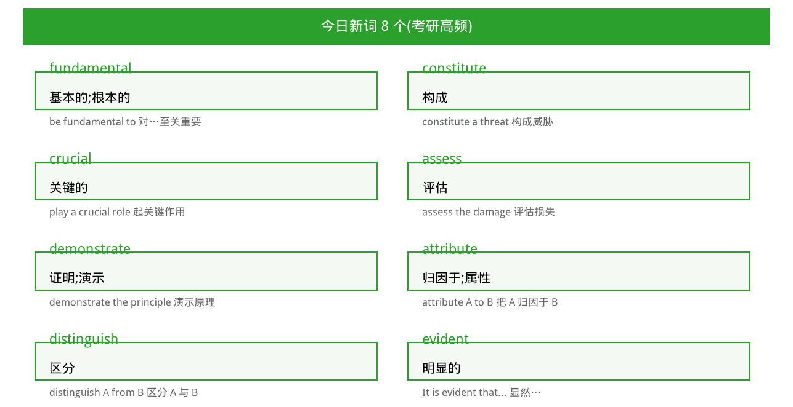
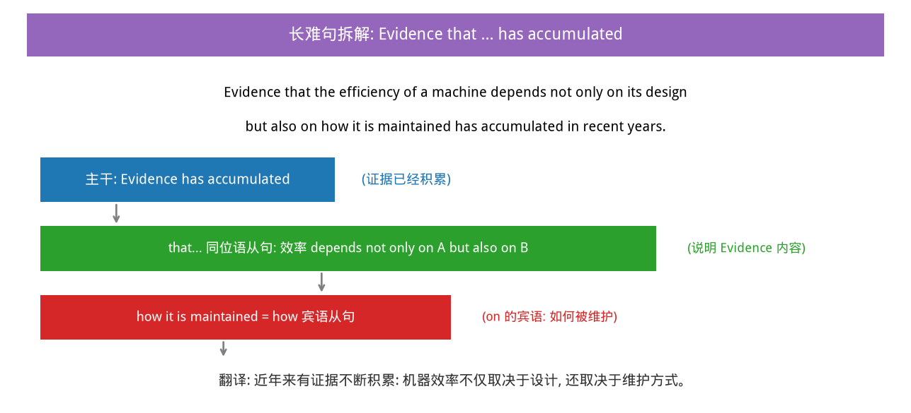

# 🇬🇧 英语 知识点笔记

> 共 **10** 个知识点 · 隔天自动更新

## lose 失去(词汇辨析)

>**掌握度:** 60% | **创建:** 2026-08-11 | **最近复习:** 2026-08-11

> 掌握度进度: ██████░░░░

**核心内容:**

lose:失去、丢失(粘度/温度/压力等逐渐减少);maintain保持;eliminate消除;rotate旋转。语境:高温→油loses粘度→摩擦

**图示:**

💡 点击展示例题答案

Under high temperature, the oil loses its viscosity.

---

## 长难句翻译:by which 定语从句

>**掌握度:** 30% | **创建:** 2026-08-11 | **最近复习:** 2026-08-11

> 掌握度进度: ███░░░░░░░

**核心内容:**

The efficiency of the pump, by which the velocity of the fluid is increased, depends mainly on the rotation of the impeller. 主干:效率主要取决于旋转;by which定从修饰pump。步骤:先找谓语动词定主干

**图示:**

💡 点击展示例题答案

离心泵的效率——流体速度正是通过该泵提高的——主要取决于叶轮的旋转

---

## 高频词汇:maintenance 维护/eliminate 消除

>**掌握度:** 60% | **创建:** 2026-08-13 | **最近复习:** 2026-08-13

> 掌握度进度: ██████░░░░

**核心内容:**

maintenance 维护保养(pump needs regular maintenance);eliminate 消除排除;同批:significant/approach/assume/derive/mechanism/velocity/rotate/friction/efficient/lubricate

**图示:**

💡 点击展示例题答案

The pump needs regular maintenance to keep friction low.

---

## attribute A to B 归因于

>**掌握度:** 40% | **创建:** 2026-08-13 | **最近复习:** 2026-08-13

> 掌握度进度: ████░░░░░░

**核心内容:**

attribute 归因于/把...归于(attribute A to B);assess 评估(不接to);distinguish A from B 区分;constitute 构成

💡 点击展示例题答案

The engineer attributed the pump failure to the lack of lubrication.

---

## 长难句:that 同位语从句

>**掌握度:** 70% | **创建:** 2026-08-13 | **最近复习:** 2026-08-13

> 掌握度进度: ███████░░░

**核心内容:**

Evidence that ... has accumulated:主干Evidence has accumulated;that引导同位语从句说明证据内容;not only...but also...并列;how引导宾语从句

**图示:**

💡 点击展示例题答案

近年证据不断积累,表明机器效率不仅取决于设计还取决于维护

---

## distinguish between A and B 区分

>**掌握度:** 30% | **创建:** 2026-08-13 | **最近复习:** 2026-08-13

> 掌握度进度: ███░░░░░░░

**核心内容:**

distinguish A from B / between A and B=区分;constitute构成;assess评估(不接to);derive获得

💡 点击展示例题答案

The technician must distinguish between mechanical faults and instrument errors.

---

## 词汇日-2026-08-07

>**掌握度:** 50% | **创建:** 2026-08-09 | **最近复习:** 2026-08-09

> 掌握度进度: █████░░░░░

**核心内容:**

词汇列表: significant=重要的/显著的, approach=方法/接近, assume=假设/承担, derive=推导/获得

**图示:**

💡 点击展示例题答案

例句: The results are statistically significant. 结果在统计上显著。

---

## 词汇日-2026-08-08

>**掌握度:** 50% | **创建:** 2026-08-09 | **最近复习:** 2026-08-09

> 掌握度进度: █████░░░░░

**核心内容:**

词汇列表: mechanism=机构/机制, velocity=速度, rotate=旋转, friction=摩擦, efficient=高效的, maintenance=维护/保养, lubricate=润滑, eliminate=消除/排除

**图示:**

💡 点击展示例题答案

长难句: The mechanism by which the velocity of the fluid is increased involves the rotation of the impeller. 流体速度增加的机制涉及叶轮的旋转。

---

## 考研真题高频词:despite/although/even though 让步连接词

>**掌握度:** 50% | **创建:** 2026-08-20 | **最近复习:** 2026-08-20

> 掌握度进度: █████░░░░░

**核心内容:**

despite(=in spite of)+名词/动名词,表让步;although/even though+完整从句,表让步。考研阅读常考让步转折关系:主句往往才是真正的重点信息。

💡 点击展示例题答案

Despite the economic downturn, the company continued to invest heavily in research and development.→主句'继续重投研发'是重点,让步部分'经济下滑'是次要背景。

---

## 词汇日-2026-08-20

>**掌握度:** 50% | **创建:** 2026-08-20 | **最近复习:** 2026-08-20

> 掌握度进度: █████░░░░░

**核心内容:**

词汇列表: resign to=顺从于, attribute A to B=把A归因于B, distinguish between A and B=区分A与B, undermine=逐渐削弱, envisage=设想, manifest=明显的/显示, aptitude=天资, indispensable=不可或缺的(Intensive后续), robust=强健的/稳健的, plausible=貌似可信的, premise=前提, consensus=共识

**图示:**

---
